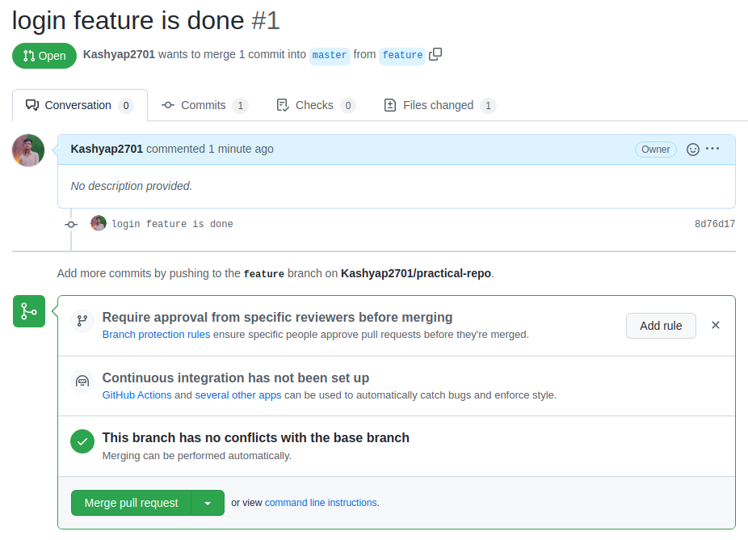
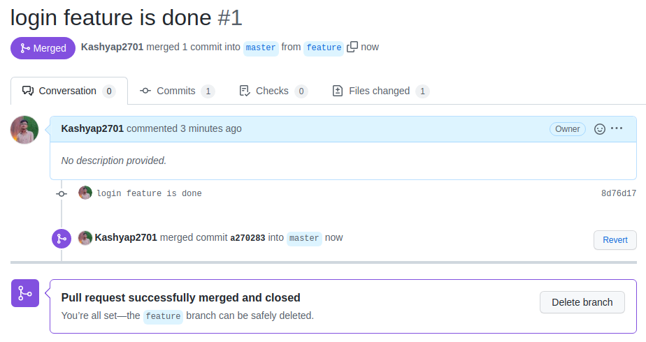
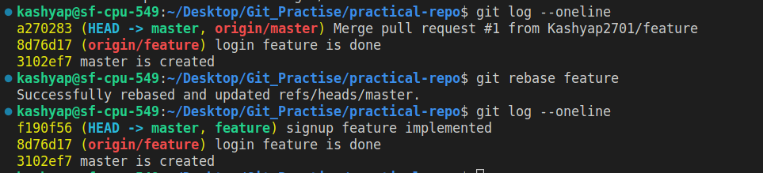
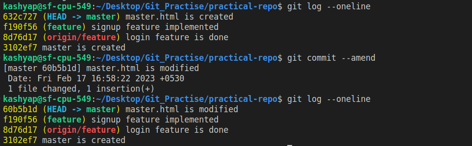
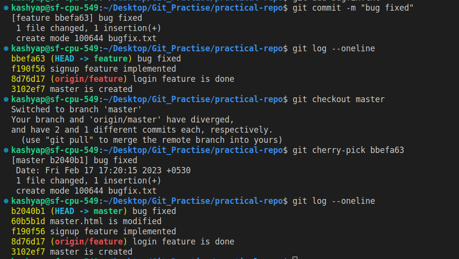
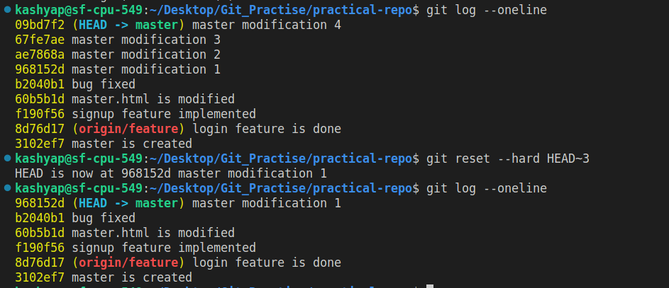

# Git Practical Exam Solution

# 1. Pull and Merge difference

- Pull Request:
Pull Request or (Merge Request) is a feature provided by Git Hosting platform such as (Github, Gitlab, etc...) to Merge changes on Remote Repository. PR is generated basically so that any higher authority or owner of Repository or even we can verify the changes before we confirm the merge.

- Pulling changes from Remote Repository:
In order to keep our Local Repository in-sync with Remote Repository we perform Pulling operation using git pull command, to pull changes from Remote Repository into the Local Repository. git pull is a Network Operation and It will fetch hashes of changes and merge them with the equivalent branch.

```sh
git pull <remote> <branch_name>
```
    
Merging Branches:
Merging is as the name suggests, an operation performed to merge/combine changes of two branches. we use git merge command to perform this operation.

```sh
git merge <branch name>
```

> Make example of pull request and two branch merge event.

```sh
# clone remote repo and create branch feature
git clone
git branch feature

# work on login component of feature branch and commit it
touch login.html
git add login.html
git commit -m "login feature is done"

# push the feature branch to remote
git push origin feature
```

- snap of generated pull request 


- snap of merge request that show owners' account



- snap of pull request merged




# 2. Rebase

- Rebase operation is performed to change the base of branch. Rebase is typically used to make Commit History Linear. We use git rebase command.

```sh
git rebase <branch_name>
```

```sh
git rebase -i <branch_name>
```

- Interactive Rebasing is used to manipulate Commit history in more flexible way.

> Try to rebase feature branch with master branch 

```sh
# pull master branch code into local
git pull origin master

# checkout feature branch
git checkout feature

# make commit
touch signup.html
git add signup.html
git commit -m "signup feature implemented"

# checkout master and rebase 
git switch master
git rebase feature
```

- you can see the logs of master branch that after rebase, the logs is changed.



# 3. Change commit message

- To change last Commit's Message we can use `--amend` option in git commit and provide a new message with `-m` option. Amend operation is used to append changes to last Commit instead of creating a new commit.

> Commit push on commit in feature branch and then change commit message

```sh
# commit on master branch
git commit -m "master.html is created"

# commit massage is changed you can see following snap. 
```



# 4. cherry pick

- Cherry Pick is used to take certain changes from another branch and apply them with current branch without Merging whole branches. we use `git cherry-pick` command to perform this operation. This will create a new Commit with the combined changes of Last commit of Current Branch and Cherry-Picked commit from another branch.

> Pick some commits from feature branch to master branch

```sh
# checkout feature branch 
git checkout branch

# fix some bug in feature branch
touch bugfix.txt
git add bugfix.txt
git commit -m "bug is fixed"

# now you can see the snap where cherry-pick is perform
```




# 5. Drop commit

- To Drop a Commit, we can use reset. We can use `git reset --hard HEAD~<number>`. Here `<number>` define how many commit are you want to reset from HEAD
- there are other option in reset like `--soft` and `--mixed` 

> Remove some commit from feature branch.

```sh
# make some commit to master branch (see the logs of master branch in snap)

# drop some commit
git reset --hard HEAD~3
```

